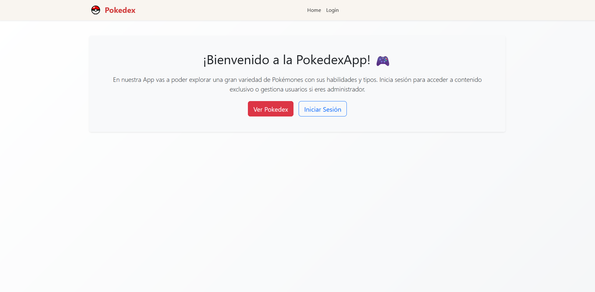
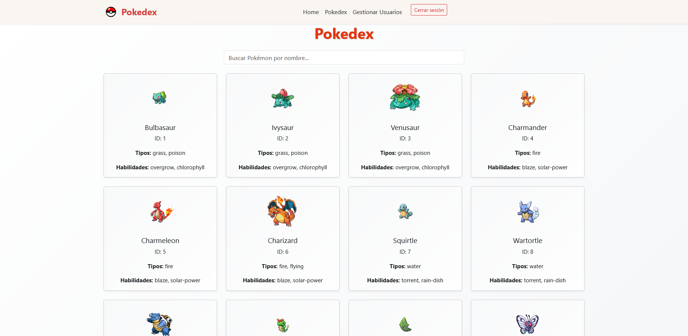

# Proyecto Full stack - Pokedex + Gestor de usuarios

Aplicación web full stack construida con React (frontend) y Node.js + Express (backend), conectada a una base de datos MySQL. 
Permite gestionar usuarios con roles y visualizar una Pokedex con paginación y búsqueda.

## 🚀 Funcionalidades principales

### 🔐 Autenticación de usuarios
- Inicio de sesión con email y contraseña.
- Almacena el token JWT y los datos del usuario en `localStorage`.

### 👤 Roles
- `admin`: acceso completo al gestor de usuarios y a la Pokedex.
- `viewer`: acceso solo a la Pokedex.

### 🧑‍💻 Panel de administración (solo para admin)
- Ver usuarios registrados.
- Crear, editar y eliminar usuarios.

### 📱 Pokedex
- Muestra 20 Pokémon por página desde la API de PokéAPI.
- Incluye búsqueda por nombre.
- Muestra Nombre, habilidades, imagen, ID, tipos.

## 🧑‍💻 Instalación y ejecución local

## ⚠️ Requisitos previos
- Tener instalado Node.js.
- Tener MySQL instalado y un servidor corriendo.

### 🔧 Pasos para iniciar el proyecto:

##  Clonar el repositorio

- git clone https://github.com/mati-gaston/pokedex-app.git

##  Ir a la carpeta backend
- cd pokedex-app/backend                # Desde la terminal, ejecute el comando para moverse a la carpeta del proyecto
- touch.env                             # Ejecute el comando para crear un archivo .env y obtenga el codigo en (/database.sql) 
- npm install                           # Instala las dependencias 
- npm start                             # Inicia el servidor backend (puerto 4000 por defecto)

##  Ir a la carpeta frontend
- cd pokedex-app / cd frontend   # Desde una nueva terminal, ejecute el comando para moverse a la carpeta del proyecto
- npm install                    # Instala las dependencias necesarias
- npm start                      # Inicia la app React (puerto 3000 por defecto)

# 🛠️ Configuración de la base de datos

1. Asegurate de tener MySQL funcionando.
2. Crear una base de datos llamada `pokedexApp`.
3. Ejecutar el script `database.sql` ubicado en la carpeta `/backend`.
   Este script creará la tabla `usuarios` y cargará un usuario de prueba.

## 👤 Usuario para ingresar

#### Ver datos en /database.sql 

## 💾 Tecnologías utilizadas

### Frontend:
- React JS
- React Router DOM
- Bootstrap 

### Backend:
- Node.js
- Express
- JWT (jsonwebtoken)
- MySQL
- bcryptjs
- dotenv

# Proyecto desarrollado por Matias Caravario.